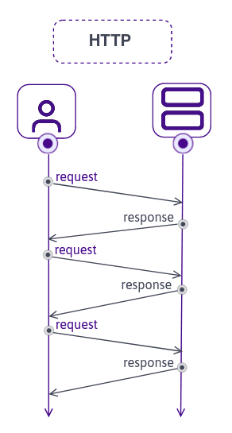
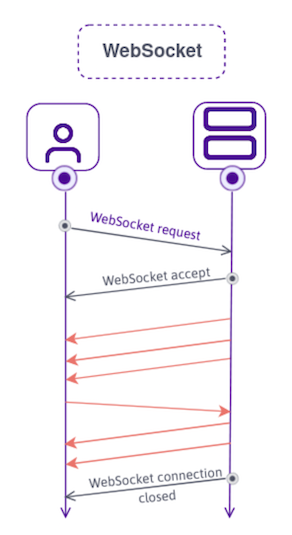

# 동시 편집 에디터 구현하기
## 1. 사용자 간의 통신을 어떤걸로 구성할까?
### 💁 HTTP, WebSocket, WebRTC 중 무엇을 선택해야 할까? 각 차이를 살펴보고 구현할 에디터에 맞춰 선택하자!
#

웹 브라우저 내의 동시 편집 에디터는 여러 명이 동시에 하나의 에디터에서 활동해야 합니다. 그러기 위해서는 네트워크가 필요합니다.  
네트워크가 무엇일까요? 그리고 왜 네트워크가 필요할까요?  
#

> ### 🙋 네트워크(Network)가 뭔가요?
Network의 어원은 그물을 뜻하는 net과 work의 합성어로, 컴퓨터들이 통신 기술을 이용하여 그물망처럼 연결된 통신 이용 형태를 말합니다.  
즉, 네트워크는  
1) 두 대 이상의 컴퓨터들을 연결하고 서로 통신할 수 있게 하는 것
2) 어떤 연결을 통해 컴퓨터의 자원을 공유하는 것  

입니다.  

동시 편집 에디터는 웹 브라우저에서(=인터넷) 여러 명이(=두 대 이상의 컴퓨터들을) 모여서(=연결하고) 한 에디터에서 활동(=어떤 연결을 통해 서로 통신하고 자원을 공유)하기 때문에 네트워크가 필요합니다.  

그렇다면 어떻게 네트워크를 통해서 에디터의 내용을 공유하고 편집할 수 있을까요?
#

제가 구현할 동시 편집 에디터는 웹 브라우저 상에서 동작하는 에디터입니다.  
우리는 웹 브라우저를 통해 인터넷에 접속하고 인터넷을 이용해서 무언가의 작업을 할 수 있습니다.

> ### 🙋 인터넷 (Internet) ? 인터넷이 웹 아니에요? (아닌데요..)
인터넷이란 이름은 '네트워크의 네트워크'를 구현하여 모든 컴퓨터를 하나의 통신망 안에 연결(International Network)하고자 하는 의도에서 이를 줄여 Internet이라고 처음 명명하였던 데 어원을 두고 있습니다.  
이후 인터넷은 '정보의 바다'라고 불리면서 컴퓨터가 서버와 클라이언트로 연결되어 [TCP(Transmission Control Protocol)](https://ko.wikipedia.org/wiki/%EC%A0%84%EC%86%A1_%EC%A0%9C%EC%96%B4_%ED%94%84%EB%A1%9C%ED%86%A0%EC%BD%9C)/[IP(Internet Protocol)](https://namu.wiki/w/IP)를 이용해 정보를 주고 받게 되었습니다.

인터넷 기반의 서비스들은 다음과 같습니다.  

이름 | 프로토콜           | 포트         | 기능
------------ |----------------|------------| -------------   
www| HTTP           | 80         | 웹서비스  
Email | SMTP/POP3/IMAP | 25/110/114 | 이메일 서비스
FTP| FTP            | 21         | 파일 전송 서비스
DNS | TCP/UDP        | 53         | 네임 서비스
NEWS | NNTP           | 119        | 인터넷 뉴스 서비스

흔히 부르는 웹(WWW, World Wide Web)은 인터넷이 아닙니다. 인터넷 기반의 대표 서비스 중 하나입니다.  
웹 브라우저는 웹을 사용할 수 있는 시작점으로, 웹 서버와의 통신을 통해 요청과 응답을 주고 받고 HTML, JavaScript, CSS를 해석하여 사용자에게 그래픽 인터페이스(GUI)를 제공합니다.  
우리는 메일을 주고 받고 다양한 자료를 올리거나 받을 수 있는 등 웹 브라우저를 통해 여러가지 웹 서비스를 이용하고 있습니다.

#

웹은 HTTP이라는 프로토콜을 사용합니다. HTTP, 웹 개발을 공부한다면 빠질 수 없는 개념입니다.
> ### 🙋 HTTP (HyperText Transfer Protocol) ? 검색창에 자동으로 붙는 그거?

HTTP는
1) 하이퍼 텍스트 문서(HTML)를 전송하기 위해 사용되는 프로토콜(= 통신 규약 및 약속).
2) 웹 브라우저와 웹 서버가 서로 소통하기 위한 프로토콜.

입니다.  

### 👉 HT(HyperText)
HTTP의 앞 두 글자는 HT는 'HyperText' 입니다. 문자 그대로 번역하자면 초월문서, 문서의 범주를 뛰어넘는다는 의미입니다. 잉?  
하이퍼텍스트(HyperText)는 참조(하이퍼링크)를 통해 사용자가 한 문서에서 다른 문서로 즉시 접근할 수 있는 텍스트입니다.  
최초로 웹이 만들어졌을 때 HTTP는 HTML(HyperText Markup Language)을 받아오기 위해 만들어졌습니다.

### 👉 TP(Transfer Protocol)
HTTP의 뒤 두 글자인 TP는 Transfer Protocol로, 통신 장비 간 데이터 교환 방식에 대해 합의한 내용입니다.  
통신을 원하는 두 개체가 무엇을, 어떻게 통신할 것인가에 대해 약속하고 이를 규칙으로 정의해놓은 것으로,  
데이터의 형식(아날로그인지, 디지털인지), 부조화(Unicode, ASCII), 신호 순서, 인증, 오류 수정 등을 포함합니다.
###

HTTP는 ❗️사용자가 요청할 때만! 서버에서 응답을 할 수 있습니다.❗️  

웹 브라우저가 HTTP를 통해 특정 페이지나 정보를 요청(Request)하게 되면 웹 서버는 요청에 응답(Response)하여 필요한 정보를 전달하게 됩니다.  
HTTP는 응답(Response)이 있기 전에 무조건 요청(Request)이 있어야 합니다.

([출처](https://blog.scaleway.com/iot-hub-what-use-case-for-websockets/))

사용자는 새로운 정보를 받기 위해서는 **반드시** 새로운 URL을 요청해야 합니다.  
= 브라우저가 웹 서버에게 요청하기 위해서는 페이지를 **이동해야만** 했습니다.  

### __만약, 화면의 일부분을 서버에서 데이터를 가져와 업데이트하고 싶어도, 모든 리소스를 다시 요청해야 합니다.__ 

### 👉  HTTP와 HTTPS는 무슨차이에요?
뒤에 붙는 S는 Secure의 앞글자입니다.   
HTTPS는 HTTP의 보안이 강화된 버전으로, HTTP 프로토콜 위에서 [SSL/TLS(암호화 계층)](https://ko.wikipedia.org/wiki/%EC%A0%84%EC%86%A1_%EA%B3%84%EC%B8%B5_%EB%B3%B4%EC%95%88)을 통해 데이터(
1) 웹페이지를 요청하는 사용자가 무슨 페이지를 요청하는지
2) 서버가 사용자에게 어떤 페이지를 주었는지

등 정보)가 암호화됩니다. 

HTTPS의 기본 [TCP/IP](https://ko.wikipedia.org/w/index.php?title=%EC%9D%B8%ED%84%B0%EB%84%B7_%ED%94%84%EB%A1%9C%ED%86%A0%EC%BD%9C_%EC%8A%A4%EC%9C%84%ED%8A%B8&tableofcontents=0)포트는 443이고 HTTPS를 사용하는 웹페이지의 URI는 'http://'대신 'https://'로 시작합니다.
#

> ### 🙋 저는 화면의 일부분만 업데이트하고 싶은데요? (AJAX, Asynchronous Javascript And Xml)
AJAX는 자바스크립트를 이용하여 HTTP를 요청하는 **비동기(Asynchronous)** 기술입니다.  

자바스크립트로 [DOM(Document Object Model, XML이나 HTML에 접근하기 위한 인터페이스)](https://developer.mozilla.org/ko/docs/Web/API/Document_Object_Model/Introduction)을 읽고 쓰며, [XHR(XMLHttpRequest, 전체 페이지의 새로고침없이도 URL로부터 데이터를 받아올 수 있어 페이지의 일부를 업데이트 할 수 있음)](https://developer.mozilla.org/ko/docs/Web/API/XMLHttpRequest) 객체를 통해 서버와 데이터를 주고 받습니다.

AJAX를 사용하면, 동일한 웹페이지 내에서(= 페이지 이동 없이) HTML 전체가 아닌 부분만 변경할 수 있습니다.
하지만, AJAX도 여전히 HTTP로 서버와 통신하기 때문에 HTTP의 한계인 **요청이 있고 그 다음 서버로 부터 응답을 받는 상황**에서 완전히 벗어나진 못했습니다.
#

> ### 🙋 요청없이도 업데이트를 하고 싶어요! (WebSocket)
HTTP에서 해결할 수 없었던 문제는 요청이 없을 때 서버로 부터 응답을 받을 수 없다는 것입니다.  
WebSocket은 HTTP의 문제를 해결해주는 통신 프로토콜로, 브라우저와 서버 사이에 양방향 통신과 실시간 통신이 가능합니다.  

❗WebSocket의 특징은 다음과 같습니다.❗
1) **양방향 소통이 가능합니다.** 
2) **실시간 통신이 가능합니다.**  

아래 그림과 같이 연결(Connection)을 유지하고 있는 동안, 브라우저는 요청없이 서버가 직접 보내는 데이터를 받을 수 있는 양방향의 실시간 데이터 통신이 가능합니다.

([출처](https://blog.scaleway.com/iot-hub-what-use-case-for-websockets/))

### 👉 socket.io는 뭐에요?
WebSocket은 양방향 소통을 위한 **프로토콜**이고,  
socket.io는 양방향 소통을 하기 위해 WebSocket 기술을 사용하는 **라이브러리**입니다.

WebSocket과 socket.io의 차이점은 다음과 같습니다.

WebSocket      | socket.io
----------------|------------   
HTML5 웹 표준 기술           | 표준 기술이 아닌, WebSocket 사용하는 라이브러리         
연결된 사용자에게 하나씩 메시지를 보냄           | 연결된 모든 사용자들에게 메시지를 Broadcasting 함        
소켓 연결 실패 시 reconnect 안함        | 소켓 연결 실패 시 fallback을 통해 다른 방식으로 알아서 reconnect 함

만약 데이터 전송이 많은 가상화폐 거래소처럼 빠르고 적은 비용으로 많은 데이터를 처리한다면 WebSocket,  
연결된 사용자들에게 Broadcasting 기능이 필요하다면 socket.io를 사용하면 좋겠습니다.
#

> ### 🙋 서버없이 브라우저끼리 통신할 수도 있나요? (WebRTC, Web Real-Time Communication)
WebRTC는 
1) 웹 브라우저, 앱(안드로이드, iOS)에서 카메라, 마이크 등을 사용하여 실시간 커뮤니케이션을 제공해주는 기술.
2) 화상통화, 화상공유 등을 구현할 수 있는 오픈소스.
3) 서버를 최대한 거치지 않고 P2P(Peer to Peer Network)로 간의 오디오, 영상 미디어, 일반 데이터를 주고 받는 기술.
4) 고성능 미디어 전송을 위해 설계된 기술. (High Performance, Hight Quality)
5) 웹에서 사용할 수 있는 유일한 P2P 기술.
6) JavaScript API로 제공.
7) UDP(User Datagram Protocol) 기반의 스트리밍 기술.

입니다.
###

###  👉 WebSocket이 있는데 왜 WebRTC을 사용해요?
WebRTC와 WebSocket은 모두 통신을 위한 기술로, 사실은 WebSocket으로도 영상을 주고 받을 수 있습니다.  
하지만 왜 WebRTC를 사용할까요?  
WebRTC는 고성능 미디어 전송을 위해 설계되었으며, 브라우저 간 직접 통신이어서 훨씬 빠르고 지연시간은 훨씬 짧습니다.
###

###  👉 WebRTC을 사용하면 WebSocket은 사용안하는건가요? 
사용합니다.  
WebRTC는 P2P 연결을 통해 직접 통신하지만 부하가 심할 수 있기 때문에 신호 서버(Signaling Server)가 필요합니다. 이때, WebSocket이나 socket.io를 사용할 수 있습니다. (XMLHttpRequest 등도 가능은 합니다)  
Signaling Server은 WebRTC 연결을 설정하는 것 외에도 중요한 정보와 기밀 데이터 유출의 위험을 최소화하는 중개자입니다.

###

WebRTC의 장점은 다음과 같습니다.
1) **지연시간(Latency)이 짧습니다.**  
   유튜브라이브, 인스타라이브, 트위치 등은 [RTMP(Real Time Messaging Protocol)](https://ko.wikipedia.org/wiki/%EB%A6%AC%EC%96%BC_%ED%83%80%EC%9E%84_%EB%A9%94%EC%8B%9C%EC%A7%95_%ED%94%84%EB%A1%9C%ED%86%A0%EC%BD%9C)를 사용하여 실시간 스트리밍을 하고 있습니다. WebRTC는 RTMP보다 낮은 지연시간(Latency)를 가지고 있고 거의 지연시간이 없는 REAL-TIME과 비슷한 방송을 할 수 있습니다.  
   사실 WebRTC보다 지연시간이 짧은 기술도 존재하긴 합니다.
2) **별도의 소프트웨어 없이 실시간 통신이 가능합니다.**  
   별도의 플러그인이나 미디어 송출 관련 소프트웨어를 설치할 필요가 없습니다.
3) **무료입니다.**  
   WebRTC이 등장하기 이전에는 고가의 라이센스를 구매하여 통화 기능, 화상회의 기능 등을 개발해야 했습니다.  
   구글이 WebRTC기술을 오픈소스로 배포하고, 크롬 브라우저에 탑재시키고 표준화 단체를 만들었습니다.
###

하지만 단점도 있습니다.
1) **크로스 브라우징의 문제가 있습니다.**  
   WebRTC는 Chrome, Opera, Firefox, 안드로이드, iOS 등 브라우저와 앱에서 활용할 수 있지만,  
   사람들이 잘 사용하지 않는 브라우저나 최신 버전을 사용하지 않은 사용자는 사용이 불가능합니다.
2) **STUN/TURN 서버가 필요합니다.**  
   P2P(Peer to Peer) 통신을 하기 위해서는 사용자의 IP주소를 알아야 합니다.  
   대부분의 사용자는 방화벽 등을 사용하기도 하고, 다른 네트워크 상에서 연결이 이루어지기 위해서는 [STUN](https://ko.wikipedia.org/wiki/STUN)/[TURN](https://ko.wikipedia.org/wiki/TURN) 서버가 반드시 필요합니다.
#

> ### 🙋 그래서 구현할 에디터는 어떤걸 사용할 거에요?
별도의 서버없이 브라우저 간 통신이 가능하다는 점에서 WebRTC로 구현해볼까 했지만 화상통화, 화상공유 등 주로 미디어 스트리밍의 목적으로 사용하는 WebRTC와 동시 편집 에디터의 컨셉이 맞지 않는다고 느껴 socket.io를 사용하려고 합니다.
#